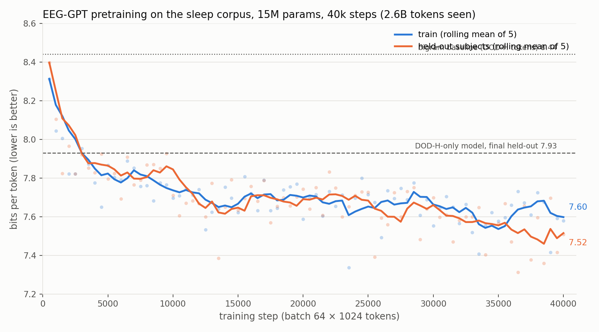
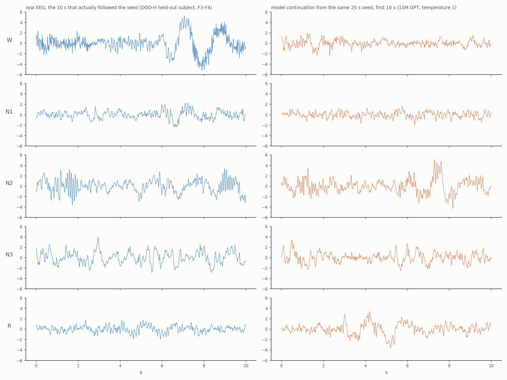
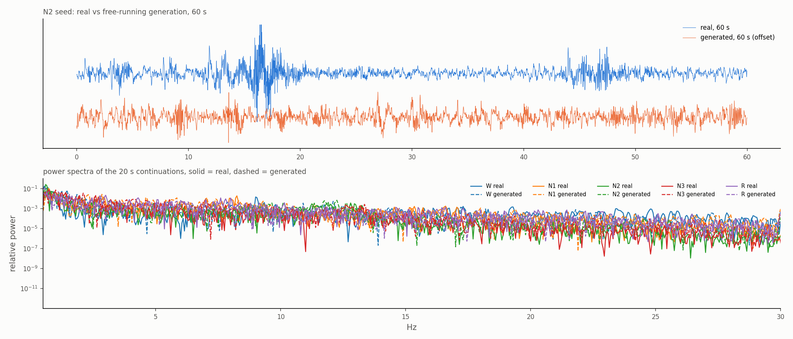

# Next-token EEG: a small generative model of sleep EEG, trained on seconds, tested on nights

Code, checkpoints and results for a two-day experiment: tokenize raw sleep EEG at 10 tokens per second, train a GPT on the token stream with no labels, then see what the model knows about whole nights of sleep.

Everything here ran on one Mac and two rented GPUs for under $30. The point was to find out quickly whether the idea holds up, not to build the biggest model.

## What is in this repo

```
gen/         tokenizer, GPT, analysis and sampling scripts
corpus/      converters that turn seven public sleep datasets into one format
checkpoints/ the two trained models and their tokenizers
figures/     the plots in this README
results/     raw numbers (json), training histories, the subject split
```

## Data

Seven public polysomnography datasets, downloaded and converted to one format: EEG at 100 Hz, 0.5 to 40 Hz bandpass, robust-scaled per channel, plus the 30 s hypnogram.

| Dataset | Nights | Where |
|---|---|---|
| PhysioNet 2018 | 994 | physionet.org (S3 mirror) |
| Bitbrain open sleep | 128 nights x 2 devices | openneuro.org |
| Sleep-EDF expanded | 197 | physionet.org |
| HMC | 151 | physionet.org |
| CAP | 105 | physionet.org |
| DOD-H | 25 | zenodo record 15900394 |
| DOD-O | 56 | zenodo record 15900394 |

Together: 1,728 recordings, about 14,000 hours of nights, 8,861 single-channel streams, 48 GB. DOD-O was kept out of training entirely and used only as a test set of apnea patients the model had never seen. ISRUC and the NSRR cohorts were not included; ISRUC's download stalled and NSRR needs a data request.

Two practical notes. The original Dreem S3 bucket no longer exists; the DOD data now lives on Zenodo as 22 GB and 36 GB zips. `corpus/fetch_dodh.py` streams one recording at a time out of the zip over HTTP range requests, which is how it fit on a laptop with 7 GB free. The PhysioNet datasets download about 50x faster from the `physionet-open` S3 bucket than from the website.

## Method

**Tokenizer.** A VQ-VAE (190k parameters) with a conv encoder that emits one 64-d vector per 100 ms, a 512-entry codebook with EMA updates and dead-code restarts, and a conv decoder. Loss is waveform MSE plus a multi-resolution log-STFT term. Trained on random 10 s crops from all channels of all datasets. Held-out reconstruction SNR is 11 dB on the mixed corpus (15 dB on DOD-H alone). It keeps slow waves and spindles and smooths out most activity above 20 Hz.

**Model.** A plain decoder-only transformer. Vocabulary is the 512 codes plus 43 tag tokens, one per dataset and channel pair, so each sequence starts with a token saying which derivation it is. Context 1024 tokens, which is 102 s. The checkpoint here is 8 layers, 384 wide, 15M parameters, trained 40k steps at batch 64, which is about 1.1 passes over the 2.3B training tokens. Next-token cross-entropy, nothing else.

**Split.** Held out 10% of subjects per dataset before anything was trained. Multi-night subjects stay on one side. 1,355 training subjects, 204 held-out, verified disjoint down to the token level.

**Evaluation.** Run the frozen model over whole held-out nights with a sliding window, keep the per-token loss and the last-layer hidden state, average the hidden states per 30 s epoch, and fit a logistic regression from those to the sleep stage. The regression is trained on training-split subjects and tested on held-out subjects.

## Results

### The loss



Held-out loss ends at 7.51 bits per token, against 8.44 for a bigram model and 8.72 for unigram. The model that was trained on DOD-H alone (25 nights) reached 7.93, so 70x more data bought 0.4 bits. Train and held-out track each other the whole way, which means the 15M model is not memorizing anyone.

### A linear readout of the frozen model stages sleep

Held-out subjects, 30 s of context, logistic regression on frozen features:

| Dataset | Accuracy | Macro F1 |
|---|---|---|
| Bitbrain | 86.0 | 72.0 |
| DOD-H (2 subjects) | 85.2 | 78.8 |
| CAP | 81.5 | 72.2 |
| Sleep-EDF | 79.8 | 71.3 |
| HMC | 78.9 | 73.4 |
| PhysioNet 2018 | 74.1 | 69.8 |

Dedicated supervised models get 80 to 89 on these, so a frozen 15M model with a linear layer is competitive but not state of the art.

### Zero-shot on a dataset it never saw

DOD-O, 56 patients with sleep apnea, 54,197 epochs, nothing from it in pretraining or in the probe's training set:

| Channel | Accuracy | Macro F1 |
|---|---|---|
| F3-M2 | 82.2 | 74.5 |
| F3-F4 | 77.1 | 65.5 |
| C3-M2 | 75.5 | 66.4 |

For comparison, a supervised CNN trained and tested within DOD-H (MorpheusNet, leave-one-subject-out) gets 84.3 on F3-M2 and 80.7 on F3-F4.

### How much context the stage needs

Same probe, hidden states averaged over the last 1, 5, 10 or 30 s of each epoch, all datasets pooled: 73.3, 74.7, 75.4, 76.5 percent. Most of what the readout uses is already there in one second.

### Where it does not transfer

A probe trained on PhysioNet F3-M2 gets 80.4 on DOD-H F3-M2 and 72.2 on HMC F3-M2, but 34.8 on Sleep-EDF Fpz-Cz and 55.2 on the Bitbrain forehead headband. The representation carries across datasets; the linear readout does not carry across montages. Each montage needs its own few hundred labeled epochs.

### Surprise by stage

N2 is the least predictable stage in every dataset and N3 and wake the most. Epochs at stage transitions are slightly less predictable than stable ones (7.72 vs 7.66 bits).

### What the samples look like



Seed the model with 25 s of real held-out EEG in each stage and let it continue. The continuation keeps the character of the stage: slow high-amplitude waves after an N3 seed, low fast activity after wake or REM. After an N2 seed it produces spindle-like 12 to 15 Hz bursts and a K-complex-shaped deflection on its own. Amplitudes are compressed and fast activity is smoothed, which is mostly the tokenizer.



### Scaling, as far as it got

A sweep at 150k steps with a fixed 256-window held-out evaluation set, run on rented GPUs and stopped early:

| Model | Layers x width | Params | Held-out bits |
|---|---|---|---|
| S | 4 x 256 | 3.7M | 7.619 |
| M | 8 x 384 | 15M | 7.554 |
| L | 12 x 512 | 39M | stopped at step 3k |
| XL | 16 x 768 | 115M | stopped at step 2k |

At 2.3B tokens the 115M model sits at 20 tokens per parameter, so anything bigger needs more data rather than more compute. Curves for S and M are on Weights & Biases (project `eeg-gpt-scaling`). The S and M weights were lost when the pods were deleted; only the 15M run-1 checkpoint survives, and it is the one in this repo.

## Things that went wrong and are worth knowing

- TensorFlow-metal on Apple silicon silently drops the ReLU of a Dense layer whose output feeds a Concatenate. A model trained on the GPU behaved differently on CPU and in TFLite. This only touched the supervised baseline (MorpheusNet); the PyTorch work here ran on MPS and CUDA.
- Memory-mapping 8,861 token files at once hits the open-file limit. Pack them into one file per split.
- Community-cloud GPU pods have no persistent disk and about 2 MB/s between each other. Copy checkpoints off as they are produced.

## Reproduce

```
pip install torch numpy scipy scikit-learn matplotlib h5py mne remotezip
python corpus/convert.py <dataset>           # per dataset, see the file header for paths
python gen/corpus_tokenizer.py               # trains the tokenizer and encodes every stream
python gen/corpus_gpt.py                     # pretraining; env vars set size, steps, context
python gen/corpus_analyze.py                 # whole-night evaluation on held-out subjects
python gen/probe_dodo.py                     # DOD-O zero-shot probes from cached features
CKPT=checkpoints DODH=<converted DOD-H folder> python gen/samples.py   # regenerates the sample figures
```

The `gen/tokenizer.py`, `gen/gpt.py`, `gen/analyze.py` and `gen/prep.py` files are the earlier DOD-H-only version of the same pipeline.

## Related work that did this at scale

While this was running I found that three groups had published close relatives in the last year: Hypnos (Oxford, next-token RQ tokens at 1 Hz on 20k PSG nights), SleepGPT (Peking, 59k hours, time-frequency pretraining) and Sleep2.0 (Johns Hopkins, 11k nights, microstates from embeddings). This repo is smaller than all of them. What it has that they do not is tokens at 100 ms rather than 1 s, which matters if the goal is forecasting events within a second.

## License

MIT. The datasets have their own licenses and are not redistributed here.
